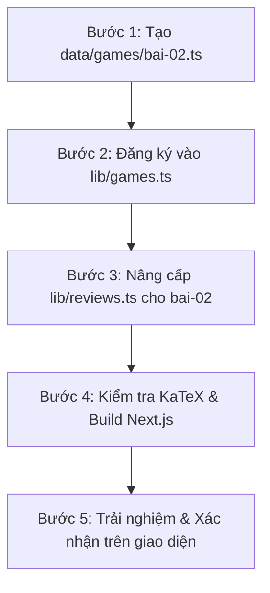

# 📘 HƯỚNG DẪN TRIỂN KHAI BÀI 2 TOÁN 10
## "TẬP HỢP VÀ CÁC PHÉP TOÁN TRÊN TẬP HỢP"
*(Đúc kết chuẩn hóa từ quy trình triển khai Bài 3 Web Tin học 12)*

---

## 🎯 I. TỔNG QUAN CÔNG VIỆC CẦN LÀM CHIỀU NAY

Ở Bài 3 Web Tin 12, ta đã hoàn thành trọn vẹn mô hình **"3 Trụ Cột Tương Tác"**:
1. **Game Hub (Đấu trường Game)**: Xây dựng các mini-game phản xạ (Sort Game, Match Game / Timeline) giúp học sinh biến lý thuyết trừu tượng thành phản xạ tự nhiên.
2. **Review Hub (Ôn tập tổng kết & Khắc sâu)**: Bản đồ tư duy (Mindmap), cạm bẫy thi cử kèm cách khắc phục, mẹo nhớ độc quyền, hệ thống Flashcard lật thẻ và Checklist tự đánh giá.
3. **Chuẩn hóa KaTeX & Giao diện**: Mọi công thức Toán/Tin đều được render sắc nét qua KaTeX, hỗ trợ cả chế độ từng câu và danh sách toàn bộ.

Đối với **Bài 2 Toán 10: Tập hợp và các phép toán trên tập hợp**, hiện tại đã có:
- ✅ SGK tương tác: `public/sgk/bai-02.html`
- ✅ Tóm tắt lý thuyết: `lib/theory.ts` (id: `bai-02`)
- ✅ Trắc nghiệm 4 lựa chọn: `lib/questions.ts` (id: `bai-02`)
- ✅ Đúng/Sai 4 ý & Tự luận: `lib/extras.ts` (id: `bai-02`)

👉 **Nhiệm vụ trọng tâm chiều nay gồm 3 bước:**
1. **Xây dựng Trung tâm Game**: Tạo `data/games/bai-02.ts` gồm 2–3 mini-game đặc trưng cho Tập hợp.
2. **Đăng ký Game vào Registry**: Cập nhật `lib/games.ts`.
3. **Nâng cấp Gói Ôn tập tổng kết**: Cập nhật `bai-02` trong `lib/reviews.ts` chuẩn KaTeX sâu sắc, bổ sung sơ đồ Venn / Trục số và Flashcard.

---

## 🎮 II. THIẾT KẾ CHI TIẾT TRUNG TÂM GAME BÀI 2 (`data/games/bai-02.ts`)

Mô hình Bài 3 Tin 12 gồm:
- **Game 1 (SortGame)**: Phân loại khái niệm cốt lõi (12–16 thẻ).
- **Game 2 (SortGame)**: Nhận diện Đúng bản chất hay Cạm bẫy đề thi (12 thẻ: 6 đúng, 6 bẫy).
- **Game 3 (MatchGame / Ghép cặp)**: Ghép đôi tương ứng (6–8 cặp).

Áp dụng chuẩn sang **Bài 2 Toán 10**:

### 🕹️ Game 1: "Máy dò Phần tử: Thuộc $(\in)$ hay Tập con $(\subset)$?"
- **Mục tiêu**: Đập tan cạm bẫy kinh điển lớn nhất của học sinh lớp 10 khi phân biệt phần tử $\in$ và tập con $\subset$, tập rỗng $\varnothing$.
- **Thể thức**: Sort Game (Vuốt thẻ / Bấm nút).
- **Nhãn phân loại**:
  - Khay Phải: `✅ Khẳng định ĐÚNG`
  - Khay Trái: `❌ Cạm bẫy SAI`
- **Bộ 12–14 thẻ bài mẫu**:
  1. `$a \in \{a; b; c\}$` $\rightarrow$ ĐÚNG ($a$ là một phần tử của tập hợp).
  2. `$\{a\} \in \{a; b; c\}$` $\rightarrow$ SAI (Bẫy: $\{a\}$ là tập con chứ không phải phần tử, phải viết $\{a\} \subset \{a; b; c\}$).
  3. `$\varnothing \subset A, \forall A$` $\rightarrow$ ĐÚNG (Tập rỗng là tập con của mọi tập hợp).
  4. `$\varnothing \in A, \forall A$` $\rightarrow$ SAI (Bẫy: $\varnothing$ là tập hợp, không phải phần tử của $A$, trừ khi $A$ là tập hợp chứa các tập hợp).
  5. `$\{1; 2\} \subset \{1; 2; 3\}$` $\rightarrow$ ĐÚNG (Mọi phần tử của tập thứ nhất đều thuộc tập thứ hai).
  6. `$1 \subset \{1; 2; 3\}$` $\rightarrow$ SAI (Bẫy: Số 1 là phần tử, phải dùng kí hiệu thuộc $\in$).
  7. `Số tập con của tập có 3 phần tử là 8` $\rightarrow$ ĐÚNG (Áp dụng công thức $2^n = 2^3 = 8$).
  8. `$-2 \in [-2; 5)$` $\rightarrow$ ĐÚNG (Ngoặc vuông '[' lấy cả đầu mút $-2$).
  9. `$5 \in [-2; 5)$` $\rightarrow$ SAI (Bẫy: Ngoặc tròn ')' không lấy đầu mút 5).
  10. `$\mathbb{N}^* \subset \mathbb{N}$` $\rightarrow$ ĐÚNG ($\mathbb{N}^* = \{1; 2; 3; \dots\}$ là tập con của $\mathbb{N} = \{0; 1; 2; 3; \dots\}$).
  11. `$0 \in \mathbb{N}^*$` $\rightarrow$ SAI (Bẫy: $\mathbb{N}^*$ là tập các số tự nhiên KHÁC 0).
  12. `$\sqrt{2} \in \mathbb{Q}$` $\rightarrow$ SAI ($\sqrt{2}$ là số vô tỉ, $\sqrt{2} \in \mathbb{R} \setminus \mathbb{Q}$).

---

### 🕹️ Game 2: "Thợ săn Phép toán Tập hợp: Giao, Hợp hay Hiệu?"
- **Mục tiêu**: Rèn phản xạ tính nhanh các phép toán tập hợp trên khoảng, đoạn số thực.
- **Thể thức**: Match Game (Ghép đôi cột trái và cột phải).
- **Bộ 6–8 cặp ghép mẫu**:
  - Cặp 1:
    - *Trái*: `Cho $A = [-2; 3]$ và $B = (1; 5)$. Giao $A \cap B$ là:`
    - *Phải*: `$(1; 3]$`
    - *Giải thích*: Lấy phần tử chung: lớn hơn 1 và bé hơn hoặc bằng 3.
  - Cặp 2:
    - *Trái*: `Cho $A = [-2; 3]$ và $B = (1; 5)$. Hợp $A \cup B$ là:`
    - *Phải*: `$\mathbf{[-2; 5)}$`
    - *Giải thích*: Gộp toàn bộ hai tập hợp từ mút nhỏ nhất đến mút lớn nhất.
  - Cặp 3:
    - *Trái*: `Cho $A = [-2; 3]$ và $B = (1; 5)$. Hiệu $A \setminus B$ là:`
    - *Phải*: `$[-2; 1]$`
    - *Giải thích*: Thuộc $A$ nhưng bỏ đi phần thuộc $B$ (từ 1 trở đi bị trừ mất, mút 1 không thuộc $B$ nên vẫn còn lại trong hiệu $\rightarrow$ ngoặc vuông tại 1).
  - Cặp 4:
    - *Trái*: `Phần bù $C_\mathbb{R} (-\infty; 4]$ là:`
    - *Phải*: `$(4; +\infty)$`
    - *Giải thích*: Phần bù trong $\mathbb{R}$ đảo ngược mút: nửa khoảng chứa 4 thì phần bù không chứa 4 (ngoặc tròn).
  - Cặp 5:
    - *Trái*: `Cho $A = (-\infty; 2)$ và $B = [2; +\infty)$. Giao $A \cap B$ là:`
    - *Phải*: `$\varnothing$`
    - *Giải thích*: Hai tập rời nhau, không có bất kì điểm chung nào.
  - Cặp 6:
    - *Trái*: `Cho $n(A) = 15, n(B) = 20, n(A \cap B) = 7$. Số phần tử $n(A \cup B)$ là:`
    - *Phải*: `$28$`
    - *Giải thích*: Công thức: $n(A \cup B) = 15 + 20 - 7 = 28$.

---

## 📋 III. NÂNG CẤP GÓI ÔN TẬP TỔNG KẾT (`lib/reviews.ts`)

Mẫu cấu trúc chuẩn đầy đủ cho `bai-02` trong `REVIEWS_BANK`:

```typescript
"bai-02": {
  summary: "Nắm trọn bản chất Tập hợp, quan hệ tập con, các tập hợp số thực (khoảng, đoạn) và thành thạo 4 phép toán cốt lõi: Giao (∩), Hợp (∪), Hiệu (\\) và Phần bù (C_E A).",
  keyPoints: [
    "Tập hợp con: $A \\subset B \\Leftrightarrow (\\forall x \\in A \\Rightarrow x \\in B)$. Tập $n$ phần tử có đúng $2^n$ tập con.",
    "Giao của hai tập hợp: $A \\cap B = \\{x \\mid x \\in A \\text{ VÀ } x \\in B\\}$ (lấy phần chung).",
    "Hợp của hai tập hợp: $A \\cup B = \\{x \\mid x \\in A \\text{ HOẶC } x \\in B\\}$ (gom tất cả).",
    "Hiệu của hai tập hợp: $A \\setminus B = \\{x \\mid x \\in A \\text{ VÀ } x \\notin B\\}$ (thuộc $A$, gạt bỏ $B$).",
    "Phần bù: Khi $A \\subset E$, phần bù của $A$ trong $E$ là $C_E A = E \\setminus A$.",
    "Công thức đếm phần tử: $n(A \\cup B) = n(A) + n(B) - n(A \\cap B)$."
  ],
  commonMistakes: [
    {
      mistake: "Nhầm lẫn giữa kí hiệu phần tử thuộc '∈' và tập con '⊂'.",
      fix: "Quy tắc: Phần tử thì đi với '∈' (ví dụ $1 \\in A$), còn Tập hợp thì đi với '⊂' (ví dụ $\\{1\\} \\subset A$). Riêng tập rỗng $\\varnothing \\subset A$ với mọi $A$."
    },
    {
      mistake: "Xác định sai ngoặc vuông '[' và ngoặc tròn '(' khi tìm hiệu hai khoảng A \\ B.",
      fix: "Nếu mút $x_0$ thuộc tập bị trừ $B$ thì trong hiệu sẽ không còn $x_0$ (dùng ngoặc tròn). Ngược lại, nếu mút $x_0$ KHÔNG thuộc $B$ thì nó vẫn còn nguyên trong $A$ (dùng ngoặc vuông)."
    },
    {
      mistake: "Quên trừ phần giao khi tính số học sinh thích ít nhất một môn.",
      fix: "Luôn dùng biểu đồ Venn hoặc công thức $n(A \\cup B) = n(A) + n(B) - n(A \\cap B)$ để tránh đếm trùng 2 lần phần chung."
    }
  ],
  tips: [
    "Kĩ thuật Trục số 1 chiều: Vẽ trục số, biểu diễn tập hợp bằng cách GẠCH BỎ phần không thuộc tập hợp. Phần trắng còn lại chính là kết quả.",
    "Mẹo nhớ phép toán: Giao là VÀ (giao lưu gặp gỡ - phần chung) · Hợp là HOẶC (hợp tác gom chung) · Hiệu là BỎ (loại trừ sạch sẽ).",
    "Số tập con: Muốn tính số tập con của tập có $n$ phần tử, bấm ngay $2^n$ trên máy tính Casio."
  ],
  flashcards: [
    {
      front: "Tập hợp rỗng $\\varnothing$ có phải là tập con của mọi tập hợp không?",
      back: "Đúng. $\\varnothing \\subset A$ với mọi tập hợp $A$."
    },
    {
      front: "Tập hợp có $n$ phần tử thì có tất cả bao nhiêu tập con?",
      back: "Có đúng $2^n$ tập con (bao gồm cả $\\varnothing$ và chính nó)."
    },
    {
      front: "Điều kiện để hai tập hợp $A$ và $B$ bằng nhau ($A = B$)?",
      back: "$A \\subset B$ và $B \\subset A$."
    },
    {
      front: "Hiệu $A \\setminus B$ là tập hợp gồm những phần tử nào?",
      back: "Gồm các phần tử thuộc $A$ nhưng không thuộc $B$."
    },
    {
      front: "Phần bù $C_E A$ được định nghĩa khi nào?",
      back: "Chỉ được định nghĩa khi $A$ là tập con của $E$ ($A \\subset E$), khi đó $C_E A = E \\setminus A$."
    },
    {
      front: "Nếu $A \\cap B = \\varnothing$ thì hai tập hợp gọi là gì?",
      back: "Hai tập hợp rời nhau."
    },
    {
      front: "Khoảng $(a; b)$ và đoạn $[a; b]$ khác nhau ở điểm nào?",
      back: "Đoạn $[a; b]$ lấy cả 2 đầu mút $a$ và $b$ ($a \\le x \\le b$); khoảng $(a; b)$ không lấy 2 đầu mút ($a < x < b$)."
    },
    {
      front: "Công thức số phần tử của hợp hai tập hữu hạn?",
      back: "$n(A \\cup B) = n(A) + n(B) - n(A \\cap B)$."
    }
  ],
  checklist: [
    "Tôi phân biệt chính xác khi nào dùng kí hiệu $\\in$ và khi nào dùng $\\subset$.",
    "Tôi thuộc công thức tính số tập con $2^n$.",
    "Tôi biểu diễn thành thạo các khoảng, đoạn, nửa khoảng trên trục số thực.",
    "Tôi tìm chuẩn xác giao, hợp, hiệu, phần bù của các tập số.",
    "Tôi giải quyết được bài toán thực tế đếm số phần tử bằng biểu đồ Venn."
  ]
}
```

---

## 🛠️ IV. CÁC BƯỚC THỰC HIỆN CỤ THỂ CHIỀU NAY



### Bước 1: Tạo file `data/games/bai-02.ts`
- Tạo file với đầy đủ 2 game: `sortGame` (Máy dò phần tử) và `matchGame` (Thợ săn phép toán tập hợp).
- Đảm bảo các công thức LaTeX bọc trong dấu `$...$`.

### Bước 2: Đăng ký vào `lib/games.ts`
- Mở `lib/games.ts`, import `bai02`:
  ```typescript
  import bai01 from "@/data/games/bai-01";
  import bai02 from "@/data/games/bai-02";

  const GAMES_MAP: Record<string, LessonGame[]> = {
    "bai-01": bai01,
    "bai-02": bai02,
  };
  ```

### Bước 3: Nâng cấp `lib/reviews.ts`
- Cập nhật mục `"bai-02"` trong `REVIEWS_BANK` với đầy đủ keyPoints, commonMistakes, tips, flashcards, checklist như thiết kế ở phần III.

### Bước 4: Kiểm tra & Chạy Build
- Chạy lệnh kiểm tra TypeScript và build Next.js:
  ```powershell
  npm run build
  ```
- Đảm bảo không có lỗi cú pháp hoặc lỗi gõ chữ.

---

## 🌟 V. ĐIỂM CẦN LƯU Ý ĐẶC BIỆT
1. **KaTeX trong Game & Review**: Mọi công thức Toán (như `$A \\cap B$`, `$[a; b]$`, `$\\mathbb{R}$`) phải dùng 2 dấu gạch chéo `\\` khi viết trong chuỗi string TypeScript (`"$\\mathbb{R}$"`).
2. **Không gian hiển thị**: Các thẻ Game đã được Antigravity tối ưu chống tràn màn hình (`transform: none` khi answered, hỗ trợ cả chế độ Từng câu và chế độ Toàn bộ danh sách).
3. **Bộ câu hỏi SGK**: Đã có sẵn file `public/sgk/bai-02.html` với KaTeX tự động tích hợp, học sinh có thể mở đọc song song trong tab SGK Chuẩn.
